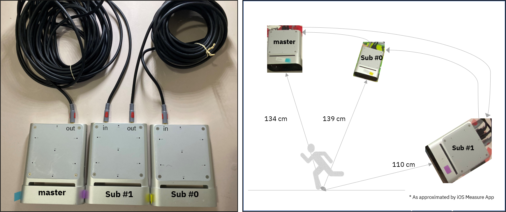
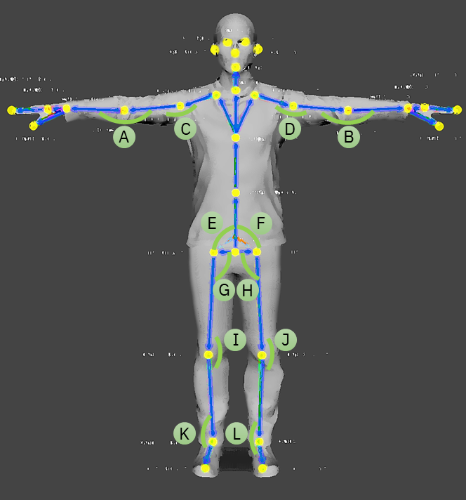

# A Low-Cost Motion Capture System using Synchronized Azure Kinect Systems

by [Andy Jeong](mailto:jeong2cu@gmail.com), [Yue Wang](mailto:leowang1996@gmail.com), [Professor Mili Shah](mailto:mili.shah@cooper.edu) (Advisor)

**Abstract**

Body joint estimation from a single vision system poses limitations in the cases of occlusion and illumination changes, while current motion capture (MOCAP) systems may be expensive. This synchronized Azure Kinect-based MOCAP system serves as a remedy to both of these problems by creating a low-cost, portable, accurate body-tracking system.

_Keywords_: Motion capture (MOCAP) system, synchronization, Kinect, body-tracking

> See [Azure.com/Kinect](https://Azure.com/kinect) for device info and available documentation.

> Link to submitted poster to ACM SIGGRAPH'20: [Poster](doc/poster_SIGGRAPH2020.pdf)

> Link to submitted abstract to ACM SIGGRAPH'20: [Abstract](doc/abstract_SIGGRAPH2020.pdf)

> Link to updated documentation: [Documentation](doc/kinect_documentation.pdf)

### Demo

> Check out the outcomes on some various movements!
> Note: this demo experiences some offset due to a parallax problem (devices are at a lower height than the human).


## Overview
> Flowchart


## System Setup

### Hardware

- [Azure Kinect DK](https://www.microsoft.com/en-us/p/azure-kinect-dk/8pp5vxmd9nhq?activetab=pivot%3aoverviewtab)
- Ubuntu 18.04 / Windows PC machine with USB3.0+ support
- USB Hub for multi-device connection (Targus 4-Port USB 3.0): [Link](https://www.amazon.com/Targus-4-Port-SuperSpeed-Adapter-ACH119US/dp/B005MR5HGI?th=1)
- USB 3.0 Extension Cable for multi-device connection: [Link](https://www.amazon.com/gp/product/B00DMFFL2W/?th=1)
- Audio Jack Cables for multi-device connection: [Link](https://www.amazon.com/Cable-Ruaeoda-3-5mm-Stereo-Audio/dp/B076S1DMXT/ref=sr_1_4?keywords=10m+3.5+jack+audio+aux+cable&qid=1579036893&s=electronics&sr=1-4)

### Software

- Azure Kinect Senor SDK (K4A) (`-lk4a`)
- Azure Kinect Body Tracking SDK (K4ABT) (`-lk4abt`)
- OpenCV (`` `pkg-config --cflags --libs opencv` ``)

### Building

```bash
g++ file.cpp -lk4a -lk4abt `pkg-config --cflags --libs opencv` -o program // compile
./program                                                                 // execute

// running on a single device
    make one && make onerun
// running on two synchronized devices
    sudo bash ./script/increaseusbmb.sh // change USB memory bandwidth size
    make two && make tworun
// running on three synchronized devices
    sudo bash ./script/increaseusbmb.sh // change USB memory bandwidth size
    make sync && make syncrun
```

## Test Setup

> Configuration

- [Daisy-chain configuration](https://docs.microsoft.com/en-us/azure/Kinect-dk/media/multicam-sync-daisychain.png): supports connection of 2+ subordinate mode devices to a single master mode device (RS-232)

> Testing Environment



> Camera Calibration to capture synchronous images
>
> - reference: green screen example from Azure Kinect SDK examples on its GitHub repository


## Outcomes

With multiple devices in place, joint estimation is still performed as if there is no occlusion or lighting effect.
The following videos and images are tested in the test setup shown above.

> Videos Samples
>
> - [3-Device System, Occlusion at Subordinate Device 1](https://drive.google.com/open?id=1aI-claeftAODyKptgQAlp-xUNikidXkd)
> - [3-Device System, Occlusion at Subordinate Device 0](https://drive.google.com/open?id=1Het_abi7CdyeqTbc__DtbvoWLhRd6bSf)
> - [3-Device System, Different Illumination at Master Device](https://drive.google.com/open?id=13--C80KyPnNHy97qZYbnvLx_eqKF4sFo)

> - [2-Device System, Armbend](https://drive.google.com/open?id=1rNm08ENJNz7gC7qcjfLROrGfcWG34cxD)
> - [3-Device System, Armbend](https://drive.google.com/open?id=1kvbwZNJAQP5ep4wQ99Aks_qvyKswSmLm)

> - [2-Device System, Standing](https://drive.google.com/open?id=1R2_ukCFXL8e6FQaPcC5eoixONgsErfYw)
> - [3-Device System, Standing](https://drive.google.com/open?id=1v21fsoo8cYNsnlP9tcl4umf7r20Sj9_Q)

---

> 2-Device | 3 -Device Systems

 | 

#### Synchronization

> - on the right: joint angles for angles designated as below




#### Occlusion / Illumination Effect Verification with 3-Device System

> Occlusion at Subordinate Device 0 | Occlusion at Subordinate Device 1 | Varying Illumination at Master Device

 |  | 

> Example of selection of data streams by confidence levels per joint


## Azure Kinect SDK Details

**Azure Kinect SDK** is a cross platform (Linux and Windows) user mode SDK to read data from your Azure Kinect device.

The Azure Kinect SDK enables you to get the most out of your Azure Kinect camera. Features include:

- Depth camera access
- RGB camera access and control (e.g. exposure and white balance)
- Motion sensor (gyroscope and accelerometer) access
- Synchronized Depth-RGB camera streaming with configurable delay between cameras
- External device synchronization control with configurable delay offset between devices
- Camera frame meta-data access for image resolution, timestamp and temperature
- Device calibration data access

## Current Work

##### 1. Gait Analysis on Exoskeletons

> OpenPose, AlphPose, Kinect, Vicon MOCAP system

##### 2. Graphical Visualization of Tracked Body Joints

> Media art collaboration

##### 3. Drone Movement Synchronzation from Human Pose

> Control of drone system (crazyflie)
